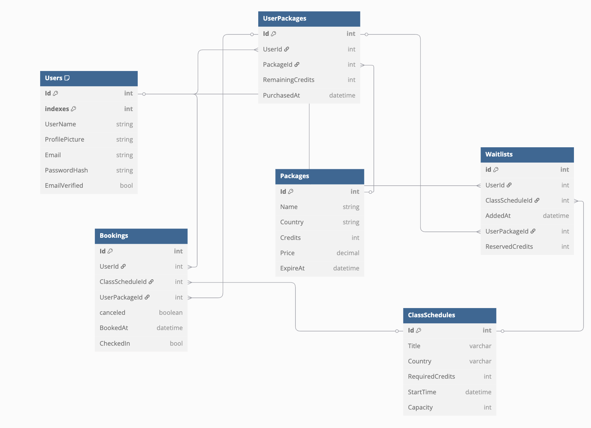

# Booking System API


This repository contains a minimal skeleton for the booking system API used in coding tests.
The project is a .NET 8 application with basic entities for users, packages, class schedules, bookings and waitlists.


--- 


The `booking-system/docs/ERD.png` file provides the database schema in 

[dbdiagram.io](https://dbdiagram.io/d/booking-system-661a925a03593b6b61e82214)

 format. You can copy the contents of that file into dbdiagram.io to visualize the relationships.





---


  
The database schema and seed data are provided in the `scripts` directory:

- **Database schema and backup:** [`booking-system/scripts/backup.sql`](booking-system/scripts/backup.sql)


## Running with Docker Compose

Use `docker-compose up` to start the API and a MySQL instance. The API will connect using the connection string defined in `docker-compose.yml` where in booking-system/booking-system.


---

### how concurrency was handled


```
[User1, User2, ..., User10]  --->  [API] ---> [Acquire Lock] ---> [Read/Update Cache] ---> [Check Capacity]
                                                          |
                                                          V
                                  [Book (if available) or Waitlist (if full)] ---> [Release Lock]

```


---


### Docker Hub

[](https://hub.docker.com/r/heinwaiyanhtet/booking-system)


## Planned Improvements

- **Set up CI/CD with GitHub Actions:**  
  I will add automated pipelines for testing and deployment using GitHub Actions.

- **Deploy to AWS ECS Fargate with Terraform:**  
  Plan to automate application deployment to AWS ECS Fargate and manage infrastructure as code using Terraform.
